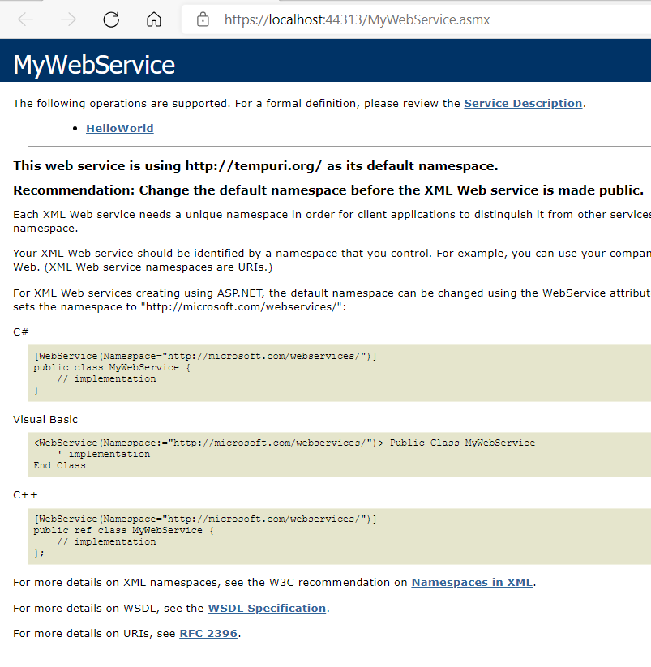
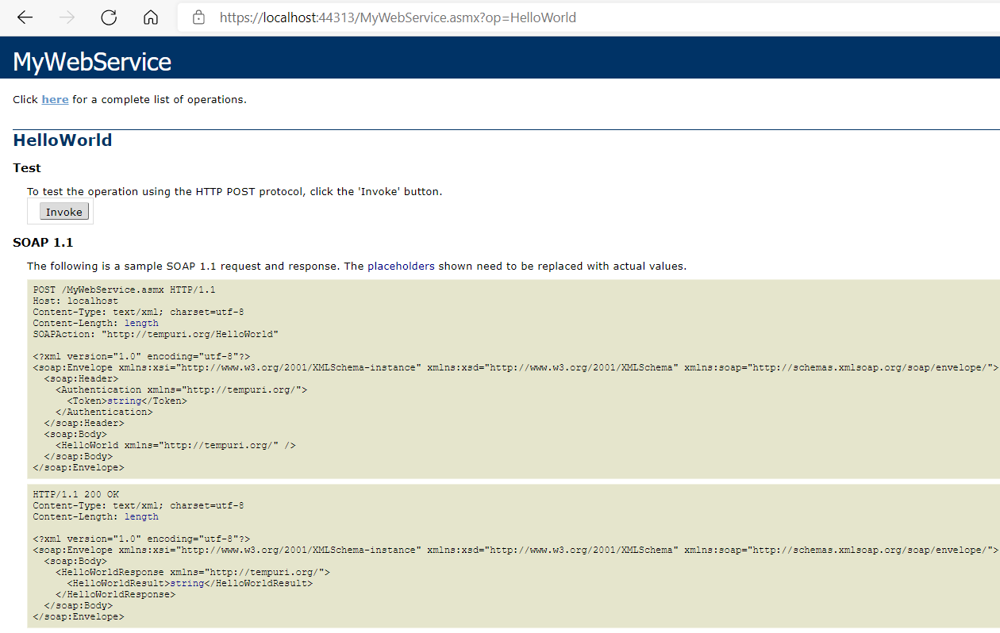
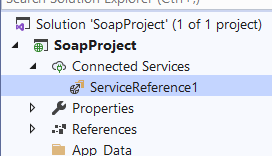
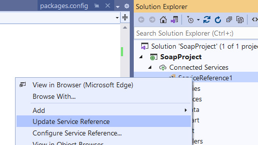
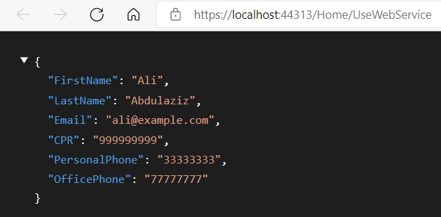
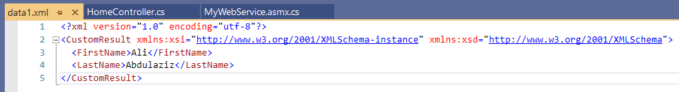

## Creating a new web service

1. Create a new `ASP.NET Web Application (.NET Framework)`. Let's call it `SoapProject`.
2. Let's use MVC template.
3. Right-click the project, then: **Add -> New Item -> Web Service (ASMX)**.
4. Let's name the service: `MyWebService`.

This will create the following starter file:

```c#
using System;
using System.Collections.Generic;
using System.Linq;
using System.Web;
using System.Web.Services;

namespace SoapProject
{
    /// <summary>
    /// Summary description for MyWebService
    /// </summary>
    [WebService(Namespace = "http://tempuri.org/")]
    [WebServiceBinding(ConformsTo = WsiProfiles.BasicProfile1_1)]
    [System.ComponentModel.ToolboxItem(false)]
    // To allow this Web Service to be called from script, using ASP.NET AJAX, uncomment the following line. 
    // [System.Web.Script.Services.ScriptService]
    public class MyWebService : System.Web.Services.WebService
    {
        [WebMethod]
        public string HelloWorld()
        {
            return "Hello World";
        }
    }
}
```

In real project, you will be required to change the following `namespace`:

```c#
[WebService(Namespace = "http://tempuri.org/")]
```

Use for example your company domain instead of `http://tempuri.org/`.

### Adding Headers

Let's create a header to use it on the `HelloWorld()` method.

First we need to use:

```c#
using System.Web.Services.Protocols
```

The we create the header class as following:

```c#
public class Authentication : SoapHeader
{
    public string Token;
}
```

Now let's use it on the `HelloWorld()` method.

First we define a new property to hold the passed value of the header:

```c#
public Authentication AuthenticationHeader;
```

Next we add the header as an attribute as following:

```c#
[WebMethod]
[SoapHeader("AuthenticationHeader")]
public string HelloWorld()
{
    return "Hello World";
}
```

Now when you use the web service you will need to pass the header value as an argument.

### Running the service

When you run the service, you should see the following page:



Click on the `HelloWorld` link, and you will see the details of the method `request` and `response`:



## Using the Web Service

To use the Web Service, you need the URL of the service. In our example the URL is:

https://localhost:44313/MyWebService.asmx

1. Right-click the `References`.
2. Select `Add Service Reference...`.
3. Paste the URL in the `Address:` field.
4. Click on `Go` to test if the service works.

If everything works properly, click `OK`. The service will be added to the project as following:



### Use the service in a controller

Let's go to `HomeController` and create a method that use the service:

```c#
public ActionResult UseWebService()
{
    ServiceReference1.MyWebServiceSoapClient client = new ServiceReference1.MyWebServiceSoapClient();

    ServiceReference1.Authentication authentication = new ServiceReference1.Authentication();

    authentication.Token = "123";

    var result = client.HelloWorld(authentication);

    return Content(result);
}
```

## Modifying The Service

Instead of returning a simple string, let's make our service return a more complex object.

Let's make the following modification on our service:

```c#
using System;
using System.Collections.Generic;
using System.Linq;
using System.Web;
using System.Web.Services;
using System.Web.Services.Protocols;

namespace SoapProject
{
    /// <summary>
    /// Summary description for MyWebService
    /// </summary>
    [WebService(Namespace = "http://tempuri.org/")]
    [WebServiceBinding(ConformsTo = WsiProfiles.BasicProfile1_1)]
    [System.ComponentModel.ToolboxItem(false)]
    // To allow this Web Service to be called from script, using ASP.NET AJAX, uncomment the following line. 
    // [System.Web.Script.Services.ScriptService]
    public class MyWebService : System.Web.Services.WebService
    {
        public Authentication AuthenticationHeader;

        [WebMethod]
        [SoapHeader("AuthenticationHeader")]
        public Employee HelloWorld()
        {
            return new Employee() { 
                FirstName = "Ali",
                LastName = "Abdulaziz",
                Email = "ali@example.com",
                CPR = "999999999",
                PersonalPhone = "33333333",
                OfficePhone = "77777777"
            };
        }
    }

    public class Authentication : SoapHeader
    {
        public string Token;
    }

    public class Employee
    {
        public string FirstName;
        public string LastName;
        public string Email;
        public string CPR;
        public string PersonalPhone;
        public string OfficePhone;
    }
}
```

Next, right-click the service reference and select `Update Service Reference`.



Finally, let's make the required changes to the `UseWebService()` method in the `HomeController` to see the result properly:

```c#
public JsonResult UseWebService()
{
    ServiceReference1.MyWebServiceSoapClient client = new ServiceReference1.MyWebServiceSoapClient();

    ServiceReference1.Authentication authentication = new ServiceReference1.Authentication();

    authentication.Token = "123";

    var result = client.HelloWorld(authentication);

    return Json(result, JsonRequestBehavior.AllowGet);
}
```

The result now should be as following:



### Export the result into XML file

Let's modify the `UseWebService()` method to export a customized result that includes only first name and last name in an XML file before returning it.

First, let's create a new XML file to store the result:

1. Right-click the `App_Data` folder.
2. Select **Add -> New Item...**.
3. Select `XML File`.
4. Let's name the file `data.xml`.

Now right-click the created file and select `Copy Full Path` to copy the path. The code should look as following:

```c#
public JsonResult UseWebService()
{
    ServiceReference1.MyWebServiceSoapClient client = new ServiceReference1.MyWebServiceSoapClient();

    ServiceReference1.Authentication authentication = new ServiceReference1.Authentication();

    authentication.Token = "123";

    // notice that we used the actual result type instead of var
    // you can move the mouse over the HelloWorld() method to
    // figure out the returned type
    ServiceReference1.Employee result = client.HelloWorld(authentication);

    // create the custom result
    CustomResult customResult = new CustomResult()
    {
        FirstName = result.FirstName,
        LastName = result.LastName
    };

    // create a serializer to serialize the result into XML
    XmlSerializer serializer = new XmlSerializer(customResult.GetType());

    // export the result
    using (TextWriter writer = new StreamWriter(@"C:\Users\Ali\Desktop\SoapProject\SoapProject\App_Data\data1.xml"))
    {
        serializer.Serialize(writer, customResult);
    }

    return Json(result, JsonRequestBehavior.AllowGet);
}

public class CustomResult
{
    public string FirstName;
    public string LastName;
}
```
Run the `UseWebService()` method again, and you will get the following result:

